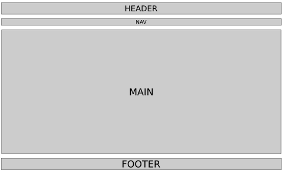
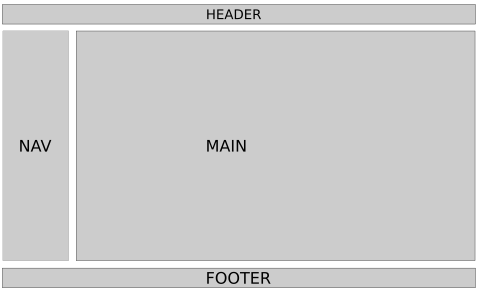

## Designing with Inkscape

Good website design begins with a solid understanding of layout.
Layouts determine how information is structured visually and guide users' interactions with your content.
A well-thought-out layout ensures that a website is aesthetically pleasing and functional, and
it helps users easily find what they need while enhancing their overall experience.

Fortunately, there are some common web layout designs, just like there are common building layouts or home layouts.
This means you do not need to invent anything new and that there is lots to explore
as you think about the kind of website you want and the kind of content you want to share.
To get started, review the [11 Website Layout Examples for Every Type of Page][11_website_layouts].

Although some of the layouts at the above link might seem complicated,
you can start by considering two common layout structures: Single Column Layout and Two-Column Layout.

The single-column layout can also be framed as a multiple row layout.
This layout is organized by rows with a header top row, navigation second row (or shared with the header row),
main content third row, and footer as the last row.
Although seemingly simple, the main [UK][uky] website follows a single column layout,
except that it contains columns within rows.

<figure>

<figcaption>
Fig. 1. Example Wireframe of a Single Column Layout
</figcaption>
</figure>

Some layouts may follow the above layout but push the navigation to the side, creating a two column layout,
with the main content area to the right (usually) or left of the navigation.
Many [Wikipedia articles][uky_wikipedia] following this kind of layout.

<figure>

<figcaption>
Fig. 2. Example Wireframe of a Two Column Layout
</figcaption>
</figure>

### Responsive Web Design

One of the biggest challenges in modern web development is designing for multiple screen sizes.
Websites must work seamlessly across devices&mdash;from large desktop monitors to small mobile screens.
This is where **responsive web design** comes into play.
Responsive design adapts a website's layout to screen size, resolution, and orientation of the device used to access your website.

#### Why Mobile Matters

We need layouts that are usable on large screens, but mobile matters for several reasons:

1. Mobile usage trends: Most [Americans have a smartphone][pew_mobile_fact_sheet] and use their smartphone browsers for accessing the web. This trend is growing around the world, too, and around 50% of global website traffic comes from mobile devices. As an example, [nearly half of Wikipedia's visitors][wikipedia_mobile] are on mobile (iOS and Android). Ignoring mobile users can therefore result in loss of engagement.
2. User expectations: Mobile users expect fast-loading, easy-to-navigate sites with content formatted for smaller screens.
3. Search engine optimization (SEO): Search engines [like Google prioritize mobile-friendly websites][google_seo] in their rankings. This is called **mobile-first indexing**.

When we begin coding our sites using HTML and CSS, we'll have to create code that adapts to both large and small screen sizes.

## Prototyping with Inkscape

Now that we've covered the importance of layout design and responsiveness,
let's discuss how to prototype these designs effectively using Inkscape.
Inkscape is a free, open-source vector graphics editor.
It's commonly used to create illustrations (such as logos), but it's a fantastic tool for creating website layout prototypes.

Prototyping is an essential step in the web design process.
It allows you to experiment with different layouts and identify issues before committing to code.
With Inkscape, you can create high-quality, scalable designs for large screens and mobile views.

### Getting Started with Inkscape for Layout Design

#### Step 1: Setting Up Your Canvas
 
1. Open Inkscape and create a new document.
2. Adjust the canvas size to match your target screen dimensions.
    - Go to File &rarr; Document Properties &rarr;
    - Select Custom size to pixels or **px**
    - For a regular desktop layout: Set the canvas width to 1440 pixels and height to 900 pixels (or a size relevant to your project).
    - For a mobile layout: Use dimensions like 360 pixels wide by 640 pixels tall.
    - Close Document Properties and press the number **5** to center canvas in Inskcape
3. To organize your work:
    - Save your desktop sized canvas file as **Desktop_Prototype.svg**.
    - Save your mobile sized canvas file as **Mobile_Prototype.svg**. 

### Step 2: Creating a Wireframe

A wireframe is a basic visual guide that represents the skeletal framework of your website.
It's generally a good idea to know the content that you want to present on a site before you wireframe,
but since we're in the exploration stage, we will worry about content later.
When we begin to write CSS but after we have written our HTML, we can revisit and revise our wireframes as needed.

Here's how to create a wireframe in Inkscape:

1. Use the **Rectangle Tool** to define sections such as headers, footers, navigation bars, and content areas.
2. Use the **Text Tool** to label each section; e.g., "Header", "Main Content", "Footer".
3. Keep the wireframe simple by using grayscale colors to focus on layout without distractions from design details.

### Step 3: Adding Design Elements

Once the wireframe is complete for your Desktop version, you can refine it by adding design elements.

1. Use shapes and gradients to visualize buttons, cards, or other interactive elements.
2. Add placeholders for images using rectangles with an **X** through them.
3. Experiment with font sizes and text alignment for headings, subheadings, and body content.
4. Save as **Desktop_Prototype.svg**.

#### Adapting Layouts for Mobile

To create a mobile version of your design:

1. Duplicate your desktop wireframe and adjust the canvas size to match mobile dimensions.
2. Rearrange elements to fit within the narrower viewport:
    1. Stack sections vertically
    2. Resize text and images for smaller screens
3. Ensure touch-friendly design by spacing buttons and interactive elements adequately.
4. Save as **Mobile_Prototype.svg**.

### Tips for Effective Prototyping

- Keep it simple: Focus on layout and structure during prototyping. Details can be added later.
- Iterate quickly: Experiment with multiple versions to explore different layouts.
- Test early: Share prototypes with peers or users to gather feedback before coding.
- See more tips at [Wireframing your layout][wireframing_wordpress].

## Closing

Designing for both desktop and mobile views is an essential skill in web development.
Using Inkscape for layout prototyping helps you visualize your designs, test ideas,
and build responsive websites effectively.
In the next two chapters, we will explore how to implement these layouts using HTML first and then CSS.
For now, experiment with Inkscape and create your own prototypes for both desktop and mobile views.

[11_website_layouts]:https://wordpress.com/blog/2024/11/14/website-layout-examples/#creating-a-website-layout-mockup
[google_seo]:https://developers.google.com/search/docs/crawling-indexing/mobile/mobile-sites-mobile-first-indexing
[pew_mobile_fact_sheet]:https://www.pewresearch.org/internet/fact-sheet/mobile/
[uky]:https://www.uky.edu/
[uky_wikipedia]:https://en.wikipedia.org/wiki/University_of_Kentucky
[wikipedia_mobile]:https://en.wikipedia.org/wiki/Usage_share_of_operating_systems
[wireframing_wordpress]:https://wordpress.com/blog/2024/11/14/website-layout-examples/#creating-a-website-layout-mockup
