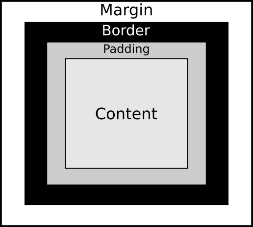

# The Box Model

The basic principle of working with CSS and HTML is knowing that all HTML elements are contained in a box.
This includes everything from the root element `<html>` all the way down to
text-level elements such as the paragraph tag `<p>`.
This is easily testable using the universal selector `*` in your CSS.
In the following code snippet, we use the universal selector to
add a border around all elements in a web document.
If you add this to your stylesheet, you will box in all HTML elements in your web document.

```
* {
  border: 1px solid black;
}
```

Furthermore, these *boxes* possess several properties.
The properties include an outer **margin**, a **border**, **padding**, and then the **content**.
This is visually represented in Figure 1 below.

<figure>

<figcaption>
Fig. 1. <a href="https://www.w3.org/TR/css-box-3/#box-model">The CSS Box Model</a>
</figcaption>
</figure>

In CSS, we can style the margin, border, padding, and content.
However, because the box model functions as the basic building block,
learning the intricacies takes time.
This is because every adjustment has ripple effects for descendant and sibliing elements.

