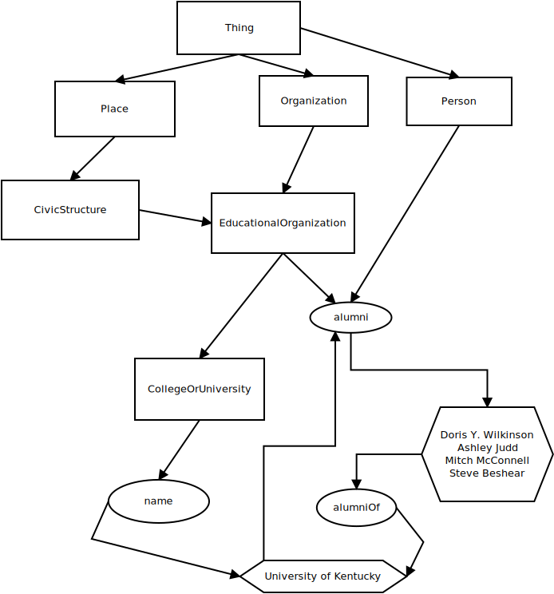

# Schema.org and Structured Data

## Introduction

Metadata plays a central role in most computer applications.
There are different data models to structure metadata.
The data model we will use to add metadata to our pages is called [schema.org][schema_org].

## Data Models: An Overview

Some data models provide a basic structure, but others are more involved.
Regardless, they all provide a sort of **controlled vocabulary**, which means they:

- reduce ambiguity by using approved terms
- promote interoperability between systems, platforms, or institutions
- allow for machine processing by enforcing structures and values.

For example, the [Dublin Core][terms_dublin_core] data model provides a flat list of controlled terms.
The main terms include:

- `contributor`
- `coverage`
- `creator`
- `date`
- `description`
- `format`
- `identifier`
- `language`
- `publisher`
- `relation`
- `rights`
- `source`
- `subject`
- `title`
- `type`

We can use this data model for all sorts of items or works.
Here I use it to describe Toni Morrison's Pulitzer Prize-winning novel, *Beloved*:

| DC Term    | Property             |
| ---------  | ----------           |
| Creator    | Toni Morrison        |
| Title      | Beloved              |
| Publisher  | Alfred A. Knopf Inc. |
| Language   | English              |
| Date       | 1987                 |
| Identifier | 1-58060-120-0        |

Unlike Dublin Core, other controlled vocabulary data models are designed to be more interconnected.
For example, [MeSH (Medical Subject Headings)][mesh_nlm] and [LCSH (Library of Congress Subject Headings)][lcsh_loc]
are types of [thesauri][thesauri_wiki].
Both are organized in a tree-like hierarchical structure;
for example, MeSH terms are arranged from broad categories (e.g., **neoplasms**) to specific categories (e.g., **Neoplasm Metastasis**).
Likewise, LCSH employs broader terms (BT, like **C (Computer Programming Language)**),
related terms (RT, like **Objective-C (Computer Programming Language)**), and
narrower terms (NT, like **Small-C (Computer Programming Language)**).
MeSH is used in biomedical and health-related indexing, such as in [PubMed][pubmed].
LCSH is often used by the Library of Congress and in academic libraries catalogs (e.g., UK's InfoKat).

## Schema.org

Then there's **schema.org**, which was created by Google, Microsoft, Yahoo, and Yandex, for the purpose of describing web content
for search engines.
Unlike the prior data models, schema.org functions more like a [taxonomy][taxonomy_wiki] and [ontology][ontology_wiki].
As a taxonomy, schema.org is a kind of hierarchical, relational classification system, and as an ontology,
schema.org stresses foundational components, such as concepts or classes, properties or attributes, relationships, and instances.

Like other data models, the schema.org vocabulary provides a method for adding structured, linked data.
The data is *linked* because types and properties can reference one another and be reused across datasets, and
it's this characteristic that creates a web of meaning that is readable by machines.

For example, the root data type in schema.org is `Thing`.
The `Thing` type includes child data types such as `Action`, `Person`, `Place`, `Organization`, and more.
These are all types of *Things* (or *classes*).
The child data types include additional descendants; for example, the following are all examples of specific classes of
an `Organization` thing:

- `Airline`,
- `EducationalOrganization`
- `PoliticalParty`,
- `LocalBusiness`, and more.

Digging deeper, if we focus on the `EducationalOrganization` type, we find that it may include other *Things*:

- `CollegeOrUniversity`
- `ElementarySchool`
- `HighSchool`, and so on.

Schema.org subclass relationships are *transitive* (if `a > b` and `b > c`, then `a > c`).
For example, the *University of Kentucky* is an `instance` of a `CollegeOrUniversity` type.
This itself is a subclass of an `EducationalOrganization`.
We could go on: an `EducationalOrganization` type is a subclass of an `Organization` type.
And finally, an `Organization` thing is a subclass of `Thing`.
We might represent this as follows:

```
- Thing
    - Organization
        - EducationalOrganization
            - CollegeOrUniversity
                - University of Kentucky (instance)
```

All classes eventually descend back to the `Thing` type, just as in biology,
all life on Earth is classified in a [taxonomy][taxonomic_bio] with `Domain` holding the broadest rank.

Furthermore, all types have **properties**.
A [`Thing`][thing_schema_org] type can have the following properties:

- `image`
- `name`
- `description`

And an `EducationalOrganization` Thing can have `alumni` as a property.

Properties take values, and those values can be simple (like text or URLs) or structured objects
with their own properties.
For example, `image` can be a URL or an `ImageObject` that includes a `caption`.

However, just like `University of Kentucky` can be counted as an instance of `CollegeOrUniversity`,
each `type` has real-world **instances** that we describe using schema.org.
To illustrate: since a `CollegeOrUniversity` thing is also an `EducationalOrganization` thing,
a `CollegeOrUniversity` thing may also have the properties specific to `EducationalOrganization`, such as `alumni`.
For instance, because `CollegeOrUniversity` inherits from `Thing`,
it can use general properties like `name`, `description`, and `url`, but
also more specific ones like `alumni` that are directly inherited from `EducationalOrganization`.

That is, schema.org supports multiple inheritance.
For example, `EducationalOrganization` is a subtype of both `Organization` and `Place`,
so a `CollegeOrUniversity` can use properties from all of those broader types.
In this way, specific `things` and `properties` can interconnect or `link` to each other, forming `linked data`.
That is, it's this ability to belong to multiple classes and to inherit properties from these classes
that enables schema.org to describe real-world complexity more naturally than rigid, single-hierarchy systems.

<figure>

<figcaption>
Fig. 2. <a href="https://schema.org/CollegeOrUniversity">Schema.org Example Map of University of Kentucky</a>.
<em>Types</em> are represented in square shapes.
<em>Properties</em> are represented in oval shapes.
<em>Instances</em> are represented in hexagonal shapes.
Diagram created using <a href="https://wiki.gnome.org/Apps/Dia">Dia</a>.
</figcaption>
</figure>

As you can see, a particular `instance` of some `Thing` may be described with multiple types.
This is similar to how people fit multiple roles.
For example, I am a professor, a parent, an offspring, etc.
You might be a student and an offspring.
Thus, we both share at least one class, and inherit the properties of that class and its broader classes, like `Person`.
By using this organizational model to describe the content of a web page, search engines can begin to *understand*
that content and its context and the relationship among *Things* on the web.

Using schema.org on your web pages requires some familiarity with the data model and what it offers.
Therefore, begin reviewing the [Full schema hierarchy][full_schema_schema_org] for a complete listing of what is available.

## Conclusion

In this section, we were introduced to the **schema.org** data model.
We learned that schema.org is a hierarchical and extensible data model, with `Thing` as the root class and
many descendant classes that inherit and extend its properties.
By understanding this structure,
we will be able to select the right types and properties that describe our web pages.

In the next section, we will use the schema.org data model to model the content of our web pages.
Then we will serialize the models we create as JSON-LD.

To sum it up:
Metadata serialized in JSON-LD is used by search engines, AI, and other services to *understand* the content expressed in HTML,
the latter of which is used for human consumption.
It accomplishes this through the schema.org vocabulary (although other data models exist for different contexts).

In the next section, we focus on the practical aspects of serializing `schema.org` as JSON-LD.

[schema_org]:https://schema.org/
[mesh_nlm]:https://www.ncbi.nlm.nih.gov/mesh/
[lcsh_loc]:https://www.loc.gov/aba/publications/FreeLCSH/freelcsh.html
[thesauri_wiki]:https://en.wikipedia.org/wiki/Thesaurus_(information_retrieval)
[terms_dublin_core]:https://www.dublincore.org/specifications/dublin-core/dcmi-terms/#section-3
[pubmed]:https://pubmed.ncbi.nlm.nih.gov/
[taxonomy_wiki]:https://en.wikipedia.org/wiki/Taxonomy
[ontology_wiki]:https://en.wikipedia.org/wiki/Ontology_(information_science)
[taxonomic_bio]:https://en.wikipedia.org/wiki/Taxonomy_(biology)
[full_schema_schema_org]:https://schema.org/docs/full.html
[thing_schema_org]:https://schema.org/Thing
